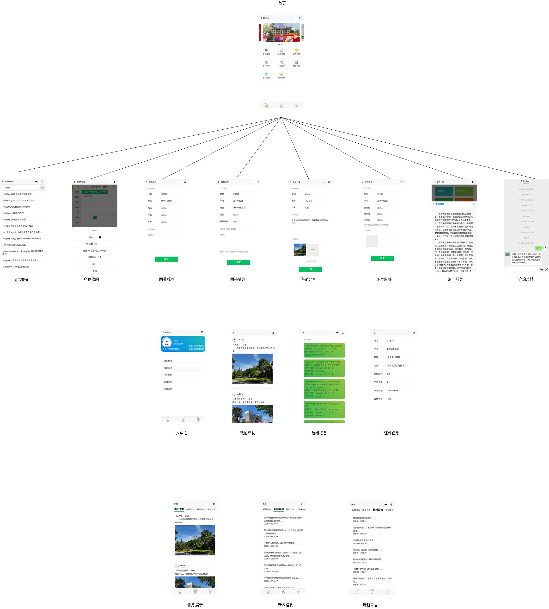

# 长安大学图书馆小程序
> 本项目是大学期间参加 **微信小程序应用开发赛** 时和一群志同道合的小伙伴们（p1, p2, ......）开发的，怀念那时候的感觉😍😍

## 介绍
* CN
CHDLibrary是一款以图书借阅辅助查询为基础，以座位预约、评论分享为特色，集咨询反馈、图书捐赠、活动发布等功能于一体的综合性图书馆微信小程序。
本小程序旨在拉近本校图书馆和学生的距离，架起两者有效沟通交互的桥梁。方便图书馆及时将图书馆工作，公告，图书馆新闻，图书活动转发到学生中，也让同学们突破校园网的限制，随时随地查阅书籍，高效预约使用图书馆有限的自习座位，分享图书心得，获取图书馆近期动态，及时归还借阅书籍，便捷咨询图书馆的相关问题。

* 介绍视频

* 效果图

* 开发思路
.png)
* 介绍文档
[CHDLibrary](./doc/CHDLibrary.docx)

